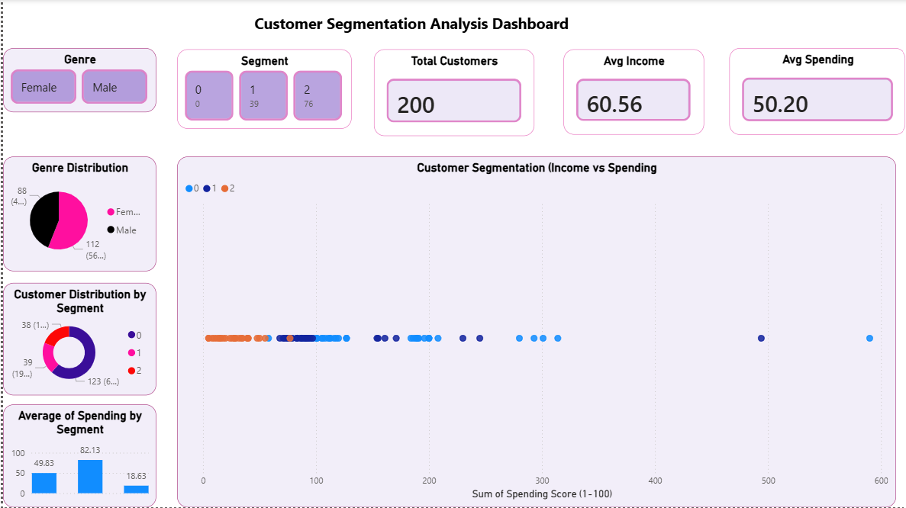

# Customer_segmentation
Segmented customers using Python, Scikit-learn, and KMeans clustering based on income, spending score, and purchasing behavior. Built an interactive Power BI dashboard with cluster visualizations and insights to support targeted marketing, customer retention, and personalization strategies.

## Dashboard Preview

# Customer Segmentation & Sales Insights Dashboard

This project focuses on customer segmentation using Python, Scikit-learn, KMeans clustering, and Power BI. The goal of the project is to group customers based on income, spending score, and purchasing behavior to identify meaningful customer segments for business decision-making.

The dataset was cleaned and analyzed using Python, followed by customer segmentation using the KMeans clustering algorithm. Customers were grouped into different segments such as high-value, medium-value, and low-value customers based on their spending patterns and behavioral characteristics.

An interactive Power BI dashboard was created to visualize customer clusters, spending behavior, segment distribution, and key customer insights. The dashboard helps businesses understand customer behavior, identify profitable customer groups, and create targeted marketing strategies.

## Key Features

- Cleaned and analyzed customer data using Python
- Applied KMeans clustering for customer segmentation
- Segmented customers based on income, spending score, and purchasing behavior
- Identified high-value, medium-value, and low-value customer groups
- Visualized customer clusters using scatter plots
- Built an interactive Power BI dashboard for segment-level insights
- Generated recommendations for targeted marketing and customer retention

## Tools Used

- Python
- Scikit-learn
- KMeans Clustering
- Power BI
- Pandas
- Excel

## Business Impact

This dashboard helps businesses identify different customer groups and understand their spending behavior. The insights can support targeted marketing campaigns, customer retention strategies, personalized offers, and better decision-making.
